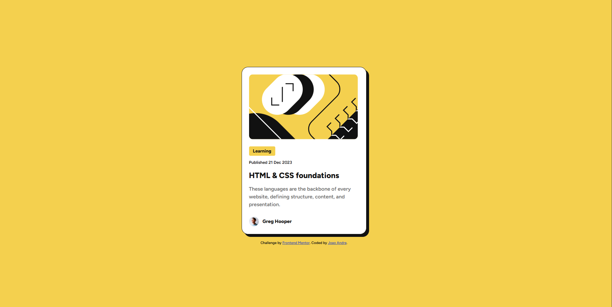

# Frontend Mentor - Blog preview card solution

This is a solution to the [Blog preview card challenge on Frontend Mentor](https://www.frontendmentor.io/challenges/blog-preview-card-ckPaj01IcS). Frontend Mentor challenges help you improve your coding skills by building realistic projects. 

## Table of contents

- [Overview](#overview)
  - [The challenge](#the-challenge)
  - [Screenshot](#screenshot)
  - [Links](#links)
- [My process](#my-process)
  - [Built with](#built-with)
  - [What I learned](#what-i-learned)
- [Author](#author)

## Overview

### The challenge

Users should be able to:

- See hover and focus states for all interactive elements on the page

### Screenshot



### Links

- Solution URL: [Blog Preview Card Solution](https://github.com/joaomfandre/frontendmentor/tree/main/blog-preview-card-component)
- Live Site URL: [Blog Preview Card Pages](https://joaomfandre.github.io/frontendmentor/blog-preview-card-component/)

## My process

### Built with

- Semantic HTML5 markup
- CSS custom properties
- Flexbox
- Mobile-first workflow

### What I learned

During this challenge I learned how to use the @font-face css rule to import the font family Figtree from the fonts folder.

```css
@font-face {
    font-family: 'Figtree';
    src: url('../fonts/static/Figtree-ExtraBold.ttf') format('truetype');
    font-weight: 800;
    font-style: normal;
}

@font-face {
    font-family: 'Figtree';
    src: url('../fonts/static/Figtree-SemiBold.ttf') format('truetype');
    font-weight: 500;
    font-style: normal;
}
```

## Author

- Github - [joaomfandre](https://github.com/joaomfandre)
- Frontend Mentor - [@joaoMFAndre](https://www.frontendmentor.io/profile/JoaoMFAndre)
